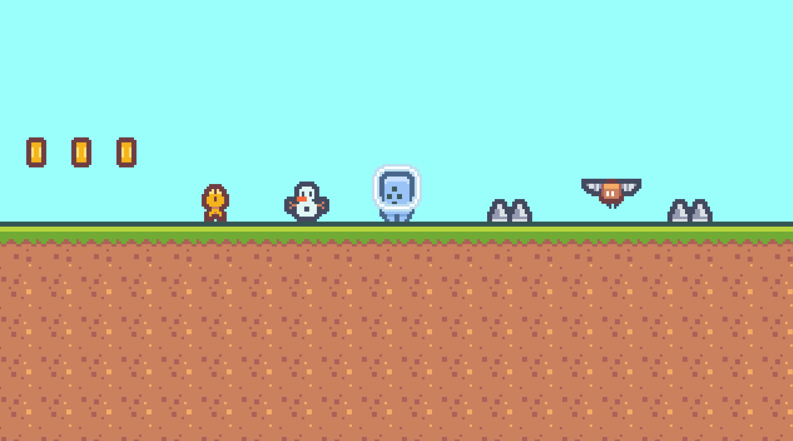

# 2D Platformer 
Taking a shot at learning the Godot Game Engine! Using a course from Udemy and their documentation.  The foundations of the game match the tutorial, but I've modified some of the mechanics to make it my own.

Tutorial by <a href="https://store.steampowered.com/search/?term=Firebelley+Games">Firebelley Games</a> and can be found <a href="https://www.udemy.com/course/create-a-complete-2d-platformer-in-the-godot-engine/"> on uDemy. </a>

<br> 

<div align="center">
    
</div>

<br>

## Download Godot
```

Linux           https://godotengine.org/download/linux
Linux Server    https://godotengine.org/download/server
MacOs           https://godotengine.org/download/osx
Windows         https://godotengine.org/download/windows

```
<br>

## Clone Repository from Github
```
git clone https://github.com/TheKicker/2D-Platformer.git
```
<br>

## Launch Godot, import the project, and edit or play.  Have fun! 

<br>
<hr> 

<div align="center">
    <br>
    <h2>Assets by <a href="https://www.kenney.nl/">Kenney 🎮</a></h2>
</div>
<br>
<hr>